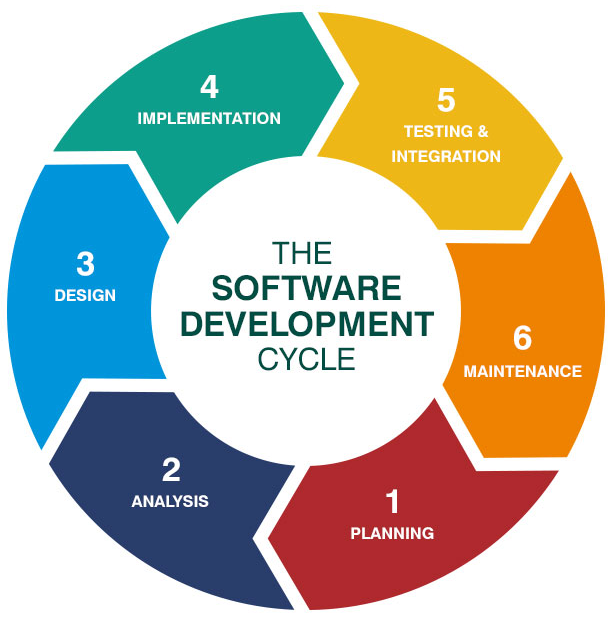

# Strand 2 Curriculum Resources
Curriculum resources that align with the Utah standards for Programming 1 - Strand 2

## Resources

### Standard 1
Demonstrate the ability to use good programming style
* Demonstrate proper use of white space (between lines and indentation)
  * [Writing Beautiful Pythonic Code with PEP 8](https://realpython.com/courses/writing-beautiful-python-code-pep-8/)
* Use appropriate naming conventions for identifiers (variables, methods, functions, and file names)
  * [Python Naming Conventions](https://realpython.com/python-pep8/)
* Construct identifiers with meaningful format; camelCase and under_score
  * [Naming Convention Cheat Sheet](../images/naming.png)

### Standard 2
Understand the software development lifecycle
* Identify specifications and understand requirements to create a solution to a problem
* Develop a program using external documentation (flowcharts, abstracts, and pseudocode) to break down the problem into sub-components
* Design solutions using algorithms
* Test program for verification of errors and proper functionality
* Provide internal comments in the IDE that explain functionality through documentation
* Redo all steps as needed

https://online.husson.edu/software-development-cycle/

### Standard 3
Identify the components of programming language syntax
* Understand keywords, identifiers, operators, and operands
  * [Python Keywords](https://www.w3schools.com/python/python_ref_keywords.asp)
  * [Python Operators](https://www.w3schools.com/python/python_operators.asp) *compare* values. They are used to check if values are equal to, less than, or greater than other values. They will return ``True`` or ``False`` values.
    * <, >, ==, != are all operators.
  * Python Operands *change* values. They are used to set a variable equal to a value.
    * =, -, + are all operands.
* Understand statements and expressions in a program
* Understand program components such as functions, methods, or procedures
  * [Python functions](https://www.w3schools.com/python/python_functions.asp)

## Projects
