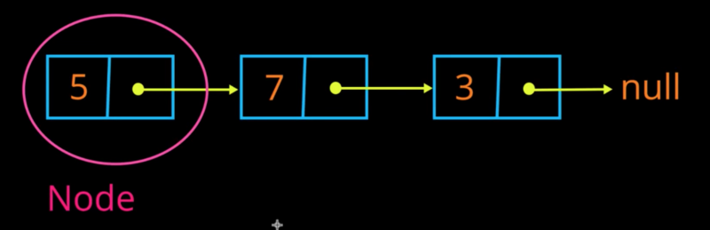

# Linked List
Implement a linked list data structure.

## What is a Linked List?
A linked list is a data structure with the following attributes:
* Made up of any number of nodes
* Each node has two data attributes - a value and a pointer
* The first node in the list is referred to as the "head", and the final node is referred to as the "tail"
* The final node in the lists points to "None"

## Instructions
Use object-oriented programming techniques to do the following:
* Create a Node class
  * Your node class must create a Node object that has two attributes - a value and a pointer
* Create a Linked List class that has the ability to:
  * Add a new Node at the beginning (create a new "head")
  * Add a new Node at the end (create a new "tail")
  * Add a new Node somewhere in the middle of the list
  * Print the entire list in order
* Your program should have a working text-based menu with options to perform different functions

## Hints
* [Click here](https://www.educative.io/edpresso/how-to-create-a-linked-list-in-python) for a tutorial on Linked Lists in Python
* [Here](https://www.tutorialspoint.com/python_data_structure/python_linked_lists.htm) is another helpful tutorial
