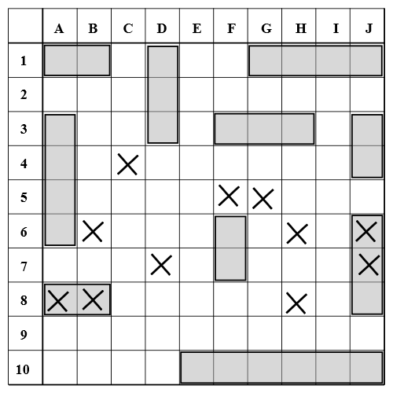

# Battleship
Write a Battleship game in Python using 2D arrays

By Actam - Own work, CC BY-SA 4.0, https://commons.wikimedia.org/w/index.php?curid=3581865

## Instructions
Create a Python program that allows one user to play Battleship against the computer. You must use two-dimensional arrays to complete this project.
* The program should let players decide where to place their ships
* The computer should not just randomly guess squares. If the computer gets a hit, it should attempt to finish the ship.
* The game must be able to determine when there is a winner, and congratulate the winning player

## Hints
* [Click here](https://www.tutorialspoint.com/python_data_structure/python_2darray.htm) for a tutorial on Python 2D arrays
* [Here](https://snakify.org/en/lessons/two_dimensional_lists_arrays/) is another helpful tutorial
* If interested, try making a computer AI that you can play against. You could even create an easy, medium, or hard setting.
