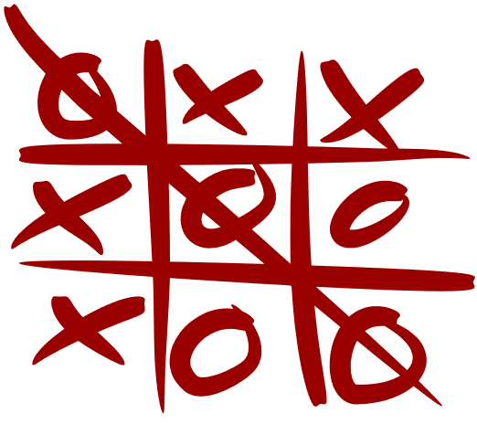

# Tic Tac Toe
Write a Tic Tac Toe game in Python using 2D arrays

## Instructions
Create a Python program that allows two users to play Tic Tac Toe. You must use two-dimensional arrays to complete this project.
* The game must be able to determine when there is a winner, and congratulate the winning player
* The game must be able to determine when there is a tie, and no player is able to win

## Hints
* [Click here](https://www.tutorialspoint.com/python_data_structure/python_2darray.htm) for a tutorial on Python 2D arrays
* [Here](https://snakify.org/en/lessons/two_dimensional_lists_arrays/) is another helpful tutorial
* If interested, try making a computer AI that you can play against. You could even create an easy, medium, or hard setting.
